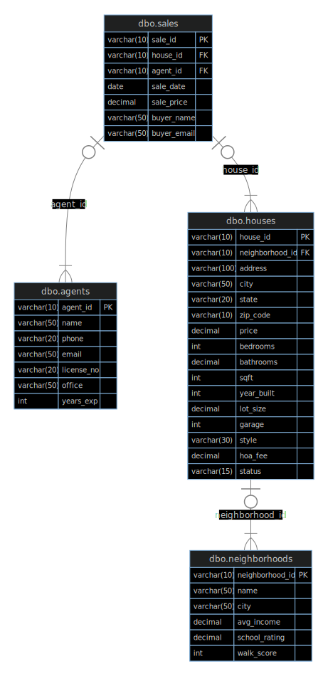

# Housing Database SQL

This repository contains T-SQL scripts for creating and managing a relational database designed for housing and real estate data. The database models information about houses, neighborhoods, sales, and agents, making it suitable for learning, analytics, and small-scale real estate projects.

---

## Features

- **SQL Server (T-SQL) Scripts**: Schema creation, sample data, and example queries.
- **Normalized Schema**: Separate tables for houses, neighborhoods, sales, and agents, with relationships enforced by foreign keys.
- **Beginner-Friendly**: Clear structure that makes it easy to understand, extend, and query.

---

## Main Tables

### `houses`
- Stores individual house details.
- **Columns include:**  
  `house_id` (PK), `address`, `neighborhood_id` (FK), `year_built`, `price`, `garage`

### `neighborhoods`
- Stores information about each neighborhood.
- **Columns include:**  
  `neighborhood_id` (PK), `name`, `walk_score`, `average_income`

### `agents`
- Stores information about real estate agents.
- **Columns include:**  
  `agent_id` (PK), `first_name`, `last_name`, `email`, `phone`

### `sales`
- Tracks each house sale.
- **Columns include:**  
  `sale_id` (PK), `house_id` (FK), `agent_id` (FK), `sale_date`, `sale_price`



---

## Example Queries

- **Find unsold houses:**
    ```sql
    SELECT h.address, h.price, n.name AS neighborhood
    FROM houses h
    JOIN neighborhoods n ON h.neighborhood_id = n.neighborhood_id
    LEFT JOIN sales s ON h.house_id = s.house_id
    WHERE s.sale_id IS NULL;
    ```

- **List houses with a garage in high-income neighborhoods:**
    ```sql
    SELECT h.address, h.price, n.name
    FROM houses h
    JOIN neighborhoods n ON h.neighborhood_id = n.neighborhood_id
    WHERE h.garage = 1 AND n.average_income > 80000;
    ```

- **Top agents by number of sales:**
    ```sql
    SELECT a.first_name, a.last_name, COUNT(s.sale_id) AS num_sales
    FROM agents a
    LEFT JOIN sales s ON a.agent_id = s.agent_id
    GROUP BY a.agent_id, a.first_name, a.last_name
    ORDER BY num_sales DESC;
    ```

---

## Getting Started

1. **Clone the repo**
    ```bash
    git clone https://github.com/blvckjoy/housing-database-sql.git
    ```
2. **Run the schema scripts** in your SQL Server environment.
3. **Insert sample data** (optional).
4. **Try the example queries** or create your own!

---

## License

This project is open-source and free to use for learning and personal projects.

---

## Author

[@blvckjoy](https://github.com/blvckjoy)


---

Happy querying! 🚀
